<picture>
  <source media="(prefers-color-scheme: dark)" srcset="./dark.svg">
  <source media="(prefers-color-scheme: light)" srcset="./light.svg">
  
</picture>

  
  
  
  

---

### About

**Yellow Duck Coders** is a software development team from Chernivtsi, Ukraine.

We build scalable digital products powered by modern web, cloud, mobile, and AI technologies — from product architecture and development to infrastructure, deployment, automation, and long-term support.

- **Focus:** Full Stack Development · Web Applications · Mobile Apps · Cloud & DevOps · AI Solutions
- **Services:** Product development · Technical modernization · AI integrations · Custom AI agents
- **Based in:** Chernivtsi, Ukraine
- **Website:** [yeducoders.com](https://yeducoders.com/)
- **Email:** [yellowduckcoders@gmail.com](mailto:yellowduckcoders@gmail.com)

---

### Tech Stack

